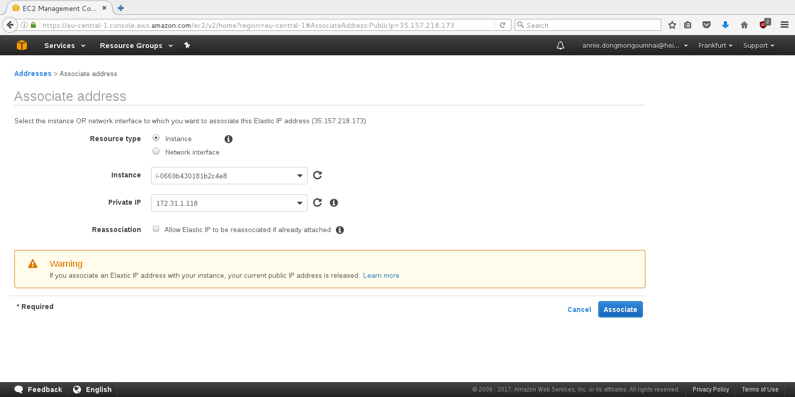

# LABORATOIRE 1 - DEPLOYMENT D'UNE APPLICATION WEB SUR UN IAAS

Le présent laboratoire nous initie aux services web, développés et proposés par
la société Amazon. Nous allons déployer une application web, en utilisant les
outils et les principes du cloud computing.

## ÉTUDIANTS

* FRANCHINI Fabien
* DONGMO NGOUMNAÏ Annie Sandra


## TABLE DES MATIÈRES

1. [Tâche 1: Initialisation et installation](#t%C3%82che-1-initialisation-et-installation)
2. [Tâche 2: Création d'une instance Amazon EC2](#t%C3%82che-2-cr%C3%89ation-dune-instance-amazon-ec2)
3. [Tâche 3: Installation d'une application web](#t%C3%82che-3-installation-dune-application-web)
4. [Tâche 4: Analyse de performance de l'instance (optionnel)](#t%C3%82che-4-analyse-de-performance-de-linstance-optionnel)
5. [Tâche 5: Consommation des ressources et tarifs](#t%C3%82che-5-consommation-des-ressources-et-tarifs)


## TÂCHE 1: INITIALISATION ET INSTALLATION

Ce chapitre décrit, les étapes permettant d'initialiser et de prendre en main,
les différents services que fournit Amazon. Par la suite, dans ce rapport,
l'acronyme AWS est employé pour désigner les services web d'Amazon. À noter,
nous partons du principe que le lecteur, possède déjà un compte AWS.

Premièrement, nous désirons nous rendre sur le tableau de bord permettant de
gérer des machines virtuelles. Pour ce faire, il faut d'une part dérouler
le menu nommé "Services", et cliquer sur l'élement "EC2" de la catégorie
"Compute".


Amazon emploie le terme d'Elastic Compute Cloud (EC2) pour désigner une
puissance de calcul redimensionnable. Concrètement, cela se présente sous la
forme de machine virtuelle disponible à la demande, et personnalisable de
manière instantanée. On parle alors d'instances EC2.

Nous remarquons, par la présence du menu déroulant à gauche, du nombre de
service impressionnant qu'offre Amazon, pour la gestion des instances EC2.


Amazon regroupe ses services dans plusieurs régions. Ces régions, représentent
un groupement de datacenters autour d'une position géographique. L'avant dernier
menu, en haut à gauche indique dans quelle région nous nous situons. Nous
pouvons aussi part ce biai, la changer.


Au total, 14 régions s'offrent à nous.

* Est des États-Unis (Virginie du Nord)
* Est des États-Unis (Ohio)
* Ouest des États-Unis (Nord de la Californie)
* Ouest des États-Unis (Oregon)
* Canada (Centre)
* Union européenne (Irlande)
* Union européenne (Frankfurt)
* Union européenne (Londre)
* Asie-Pacifique (Singapoure)
* Asie-Pacifique (Sydney)
* Asie-Pacifique (Seoul)
* Asie-Pacifique (Tokyo)
* Asie-Pacifique (Mumbai)
* Amérique du Sud (São Paulo)

Par souci de proximité, nous choisissons, d'opérer dans la région de Frankfurt,
en Allemagne.

### GÉNÉRATION DES CLÉS CRYPTOGRAPHIQUES

À présent, nous allons générer une paire de clés cryptographiques, nous
permettant ainsi, de nous connecter à une instance EC2.

Pour ce faire, il faut se rendre dans le sous-menu "Key Pairs" de la catégorie
"Network & Security" et cliquer sur le bouton "Create Key Pair".


Premièrement, il faut lui donner un nom. Nous suivons [les recommandations](http://docs.aws.amazon.com/AWSEC2/latest/UserGuide/get-set-up-for-amazon-ec2.html#create-a-key-pair) d'Amazon pour le choix du nom.


Ensuite, la paire de clés est générée automatiquement et nous somme invités à
choisir son emplacement, sur notre machine. Comme nous fonctionnons sur un
système Unix-like, nous choisissons de la sauvegarder dans `$HOME/.ssh`.


Nous pouvons à présent voir la présence de notre nouvelle paire de clés sur le
tableau de bord.


Pour terminer, nous devons protéger localement cette paire en définissant des
droits d'accès, restreints.

```
$ cd ~/.ssh
$ chmod 400 franchini-key-pair-eu-central-1.pem
```

### CRÉATION DU PARE-FEU

Amazon utilise le terme de "Security Groups" pour définir un ensemble de règles
de pare-feu. Pour créer un nouvel ensemble de règles, il faut se rendre dans le
sous-menu "Security Groups" de la catégorie "Network and Security" et cliquer
sur "Create Security Group".


Nous lui donnons comme nom, "Franchini-default". À cet endroit nous pouvons
déjà définir des règles.


Ensuite, nous confirmons la présence du nouvel ensemble créé.


## TÂCHE 2: CRÉATION D'UNE INSTANCE AMAZON EC2

Ce chapitre décrit, les étapes permettant l'installation d'une instance EC2 et
son initialisation.

Premièrement, il faut se rendre dans le sous-menu "Instances" de la catégorie
"Instances" et cliquer sur "Launch Instance".


Nous sommes redirigés sur un formulaire, décomposé en plusieurs étapes.

Premièrement, nous devons spécifier à partir de quel image (AMI), l'instance va
être générée.


Pour les besoins du laboratoire, nous souhaitons utiliser une image d'Ubuntu
14.04 ayant pour identifiant `AMI Id: ami-26c43149`. Pour ce faire nous devons
opérer une recherche sur les images communautaires et la sélectionner.


Ensuite, nous devons spécifier la puissance de calcul qu'on lui accorde. Nous
choisissons l'offre `t2.medium`, qui est adaptée à nos besoins.


Comme la troisième étape ne nous concerne pas, elle est sautée. Dans la
quatrième, nous configurons le stockage des données. Pour qu'il y ait
persistence, nous décochons l'option "Delete on termination".


Comme la cinquième étape ne nous concerne pas, elle est sautée. Ici, nous sommes
invités à configurer le pare-feu. Pour ce faire nous créons un nouveau
"Security Group", nommé "franchini-Drupal". Nous lui créons d'ores et déjà, une
règle permettant l'accès à la machine via le protocole SSH.


Dans la septième étape, nous sommes invités à confirmer nos choix avant la
génération de l'instance.


Avant confirmation et création, nous devons choisir avec quelle paire de clés
nous pouvons accèder à notre machine via SSH.


Nous pouvons confirmer la création de l'instance, par sa présence dans le
tableau de bord.


Nous nous loggons une première fois via SSH en spécifiant le chemin de la paire
de clés cryptographiques, le nom d'utilisateur de la machine, et son nom de
domaine public (ec2-35-157-223-171.eu-central-1.compute.amazonaws.com).

```
$ ssh -i ~/.ssh/franchini-key-pair-eu-central-1.pem ubuntu@ec2-35-157-223-171.eu-central-1.compute.amazonaws.com
Welcome to Ubuntu 14.04.4 LTS (GNU/Linux 3.13.0-92-generic x86_64)

 * Documentation:  https://help.ubuntu.com/

  System information as of Tue Feb 28 12:31:41 UTC 2017

  System load:  0.0               Processes:           104
  Usage of /:   10.0% of 7.74GB   Users logged in:     0
  Memory usage: 1%                IP address for eth0: 172.31.1.118
  Swap usage:   0%

  Graph this data and manage this system at:
    https://landscape.canonical.com/

  Get cloud support with Ubuntu Advantage Cloud Guest:
    http://www.ubuntu.com/business/services/cloud

0 packages can be updated.
0 updates are security updates.

New release '16.04.2 LTS' available.
Run 'do-release-upgrade' to upgrade to it.


The programs included with the Ubuntu system are free software;
the exact distribution terms for each program are described in the
individual files in /usr/share/doc/*/copyright.

Ubuntu comes with ABSOLUTELY NO WARRANTY, to the extent permitted by
applicable law.

ubuntu@ip-172-31-1-118:~$ hostname
ip-172-31-1-118
ubuntu@ip-172-31-1-118:~$ uname -a
Linux ip-172-31-1-118 3.13.0-92-generic #139-Ubuntu SMP Tue Jun 28 20:42:26 UTC 2016 x86_64 x86_64 x86_64 GNU/Linux
ubuntu@ip-172-31-1-118:~$ ifconfig
eth0      Link encap:Ethernet  HWaddr 06:4f:68:04:3a:41  
          inet addr:172.31.1.118  Bcast:172.31.15.255  Mask:255.255.240.0
          inet6 addr: fe80::44f:68ff:fe04:3a41/64 Scope:Link
          UP BROADCAST RUNNING MULTICAST  MTU:9001  Metric:1
          RX packets:50446 errors:0 dropped:0 overruns:0 frame:0
          TX packets:8442 errors:0 dropped:0 overruns:0 carrier:0
          collisions:0 txqueuelen:1000
          RX bytes:71673026 (71.6 MB)  TX bytes:757734 (757.7 KB)

lo        Link encap:Local Loopback  
          inet addr:127.0.0.1  Mask:255.0.0.0
          inet6 addr: ::1/128 Scope:Host
          UP LOOPBACK RUNNING  MTU:65536  Metric:1
          RX packets:0 errors:0 dropped:0 overruns:0 frame:0
          TX packets:0 errors:0 dropped:0 overruns:0 carrier:0
          collisions:0 txqueuelen:0
          RX bytes:0 (0.0 B)  TX bytes:0 (0.0 B)
```

En fesant un `ifconfig` nous aperçevons que l'adresse `172.31.1.118`, c'est
[une adresse IP privée](https://en.wikipedia.org/wiki/Private_network#Private_IPv4_address_spaces),
à l'interne de l'infrastructure. Pour accèder à la machine de l'extérieur, il
faut utiliser l'adresse IP publique `35.157.223.171` ou son nom de domaine
publique.

Comme demandé, nous opérons un premier `ping` sur la machine distante.

```
$ ping 35.157.223.171
PING 35.157.223.171 (35.157.223.171) 56(84) bytes of data.
^C
--- 35.157.223.171 ping statistics ---
4 packets transmitted, 0 received, 100% packet loss, time 2999ms
```

Nous remarquons que nous reçevons aucune réponse de sa part. C'est normal, cela
est dû au fait que le pare-feu bloque les requêtes ICMP, envoyés par `ping`.
Nous devons mettre à jours la configuration du pare-feu.

Pour ce faire nous devons d'une part retourner dans le tableau de bord des
"Security Groups". Après avoir sélectionner notre "Security Group",
"franchini-Drupal", nous choisissons dans le menu "Actions", l'option
"Edit inbound rules".


Nous sélectionnons l'action, "Add rule", en bas à gauche.


Dans le menu déroulant du type, nous sélectionnons "All ICMP - IPv4" et nous
autorisons la réception de ces requêtes, depuis n'importe où.


Nous réitérons le `ping` et observons que tout fonctionne correctement.

```
$ ping -c 5 35.157.223.171
PING 35.157.223.171 (35.157.223.171) 56(84) bytes of data.
64 bytes from 35.157.223.171 (35.157.223.171): icmp_seq=1 ttl=47 time=24.7 ms
64 bytes from 35.157.223.171 (35.157.223.171): icmp_seq=2 ttl=47 time=24.9 ms
64 bytes from 35.157.223.171 (35.157.223.171): icmp_seq=3 ttl=47 time=24.6 ms
64 bytes from 35.157.223.171 (35.157.223.171): icmp_seq=4 ttl=47 time=24.8 ms
64 bytes from 35.157.223.171 (35.157.223.171): icmp_seq=5 ttl=47 time=24.5 ms

--- 35.157.223.171 ping statistics ---
5 packets transmitted, 5 received, 0% packet loss, time 4005ms
rtt min/avg/max/mdev = 24.545/24.753/24.982/0.229 ms
```

## TÂCHE 3: INSTALLATION D'UNE APPLICATION WEB

Ce chapitre, décrit de manière détaillée l'installation et la configuration du
[CMS Drupal](https://www.drupal.org/) et de la création d'une IP fixe.


Premièrement nous nous concentrons sur l'installation du CMS. Nous devons d'une
part accèder à la machine et installer les paquets nécessaires.

```
ubuntu@ip-172-31-1-118:~$ sudo apt-get update && sudo apt-get install drupal7
```

Ensuite nous devons mettre à jours le pare-feu, pour accepter les connexions
HTTP entrantes **Procédure non-détaillée cf. Tâche 2**.

Nous nous rendons ensuite à l'adresse [http://ec2-35-157-223-171.eu-central-1.compute.amazonaws.com](http://ec2-35-157-223-171.eu-central-1.compute.amazonaws.com)
pour voir si tout fonctionne.


Nous remarquons que nous atterissons sur la page d'accueil de `apache2`. Nous
devons changer ça configuration, pour être ainsi redigiré sur le CMS installé.

```
ubuntu@ip-172-31-1-118:~$ sudo cp /etc/drupal/7/apache2.conf /etc/apache2/mods-enabled/drupal.conf
ubuntu@ip-172-31-1-118:~$ sudo service apache2 restart
 * Restarting web server apache2   
```

À présent nous devons rajouter le sous-dossier `/drupal7/` à l'URL, pour accèder
au CMS. [http://ec2-35-157-218-171.eu-central-1.compute.amazonaws.com/drupal7/](http://ec2-35-157-218-171.eu-central-1.compute.amazonaws.com/drupal7/)

Nous fournissons à titre indicatif, la procédure d'installation du CMS.


À présent, nous souhaitons attribuer une IP fixe à notre instance EC2. L'adresse
IP fournie de base pour notre instance EC2, est dynamique. Si nous redemarrons
notre instance, nous n'avons pas la garantie que la même adresse sera attribuée.
Dans le cadre d'une application web en production, nous sommes obligés de
recourir à une IP fixe (Elastic IP), sans quoi l'application pourrait être
indisponible à tout moment.

Comme le nom de domaine publique, premièrement attribué dérive de l'adresse IP
courante, nous ne pouvons pas l'utiliser pour les raisons mentionnés avant.

Premièrement, il faut se rendre dans le sous-menu "Elastic IPs" de la catégorie
"Network and Security" et cliquer sur "Allocate new address".


Ensuite, il faut uniquement cliquer sur le bouton "Allocate".


Nous avons la confirmation qu'une nouvelle adresse IP fixe nous a été attribué
(35.157.218.173),


À partir de ça, il nous est nécessaire d'associer cette nouvelle adresse, à
notre instance EC2. Il faut se rendre dans le menu déroulant "Action" et cliquer
sur "Associate address".


Nous choisissons à cet endroit, l'instance à qui associer l'IP fixe.




## TÂCHE 4: ANALYSE DE PERFORMANCE DE L'INSTANCE (OPTIONNELLE)

Dans ce chapitre, nous utilisons le logiciel/service `geekbench3` pour mesurer
la puissance de calcul de notre instance EC2.

Premièrement, nous suivons la procédure d'installation proposée dans la donnée
du laboratoire. Pour cette expérience nous mesurons la puissance de calcul de
l'offre `t2.medium`, `t2.large` et `c4.4xlarge`.

```
$ ./geekbench
Geekbench 3.3.0 Tryout : http://www.primatelabs.com/geekbench/

Geekbench 3 is in tryout mode.
[...]
Running Gathering system information
[...]
Uploading results to the Geekbench Browser. This could take a minute or two
depending on the speed of your internet connection.
[...]
```

Après la simulation terminée, `geekbench` nous retourne les résultats sous la
forme d'une url à consulter.

* Résultats pour l'offre `t2.medium` : [Lien](http://browser.primatelabs.com/geekbench3/8274721)
* Résultats pour l'offre `t2.large` : [Lien](http://browser.primatelabs.com/geekbench3/8276675)
* Résultats pour l'offre `c4.4xlarge` : [Lien](http://browser.primatelabs.com/geekbench3/8276713)

`geekbench` lance une série de calculs spécifiques pour ensuite attribuer lui
une note de performance. La note est comptée en points et est proportionelle à
la vitesse de calcul du test effectué.

La version 3 de `geekbench` utilise un `Mac mini (Mid 2011) with an Intel Core i5-2520M @ 2.50 GHz processor`
comme base pour attribuer ses notes. Un calcul opéré par cette machine vaut
2500 pts. Les résultats retournés pour les simulations sont proportionnels à
cette base. Par exemple un score du 5000 pts, équivaut à une puissance de calcul
2x plus grande que la base.

### RÉCAPITULATIF DES RÉSULTATS

|| t2.medium | t2.large | c4.4xlarge |
| -- | --------- | -------- | ---------- |
| System informations | Intel Xeon E5-2676 v3 @ 2.40 GHz 1 processor, 2 cores | Intel Xeon E5-2676 v3 @ 2.40 GHz 1 processor, 2 cores | Intel Xeon E5-2666 v3 @ 2.90 GHz 1 processor, 8 cores, 16 threads |
| Overall Performance | 2557 / 5040 | 2618 / 5113 | 2979 / 22814 |
| Integer Performance | 2689 / 5318 | 2758 / 5373 | 3242 / 27120 |
| Floating Point Performance | 2513 / 5047 | 2541 / 5016 | 3033 / 28067 |
| Memory Performance | 2383 / 4471 | 2495 / 4791 | 2346 / 3697 |
|| Single-core / Multi-core | Single-core / Multi-core | Single-core / Multi-core |

## TÂCHE 5: CONSOMMATION DES RESSOURCES ET TARIFS

Dans ce chapitre, nous opérons à un survol du système de facturation d'Amazon
pour les AWS.

Pour ce rendre sur le tableau de bord de facturation, il faut dans
l'avant-dernier menu en haut à gauche, cliquer sur "My Billing Dashboard". Nous
atterissons ainsi sur une vue d'ensemble des coûts d'utilisation des services.


Nous remarquons d'ores et déjà qu'apparement rien ne nous a été facturé. Ceci
est dû à l'offre "étudiante" qui nous ai été offerte.


Pour connaître le détail des ressources utilisé, il faut dérouler le sous-menu
"Elastic Compute Cloud". On constate que l'instance `t2.medium` a été utilisé
pendant 7 heures et a été facturé 0.39$.


Amazon attribue un tarif de base pour chaque type d'instance et ensuite calcul
le prix final selon le temps d'utilisation et les ressources utilisées
(Stockage nottament).

Pour 1 mois d'utilisation en continu d'une instance `t2.medium` cela nous
couterait un peu moins de 40$.


